15 サポートベクターマシンと文書の機械学習
==========================================

2013年8月28日（水）

[資料（英語）](http://nlp.stanford.edu/IR-book/pdf/15svm.pdf)

序
--

__サポートベクターマシン (SVM)__

- ラージマージン分類機の一種
- ベクトル空間に基づいた機械学習法
- 訓練データ（いくつかの点を外れ値もしくはノイズとして除く）のあらゆる点から最も離れている2つのクラスの間の決定境界を見つける

15.1 サポートベクターマシン -- 線形分離可能な場合
--------------------------------------------------

__SVM__ ...あらゆるデータ点からの距離が最大となる決定面を求める基準を定義

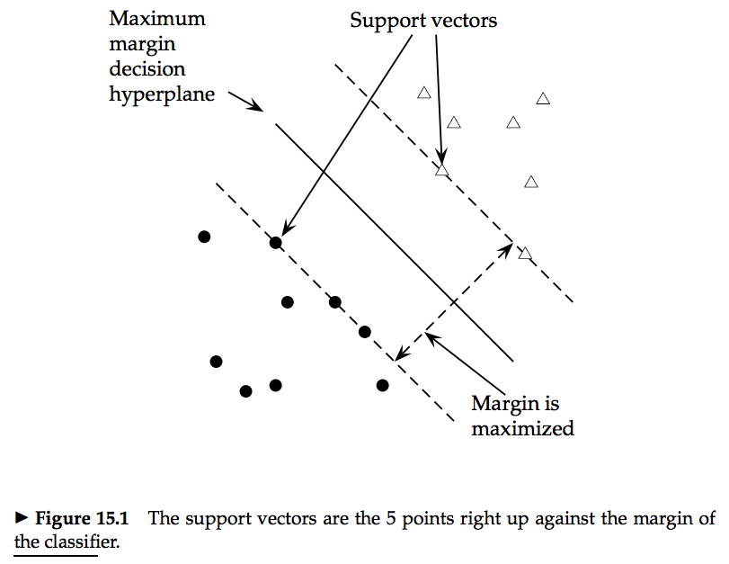

- __最大マージン決定超平面__ _(Maximum decision hyperplane)_ ...実線の直線
- __分離面__...点線の直線?
- 分離面の __マージン__ _(margin)_ ...決定面から最近データ点に接するまでの距離
- __サポートベクター__ _(support vector)_ ...分離面の位置を定義するデータ（原点からその点までのベクトル）

### マージン最大化

__マージン最大化__ ...マージンが最大になるように分類面を決定すること?

- 分類に安全マージンを与える
 - 分離面にわずかな誤差があっても分類誤りを引き起こさない

### SVMの定式化

- _b_ ...定数項
- _w_ ...決定超平面法線ベクトル（重みベクトル）
 - 超平面に垂直

決定超平面は _b_ と _w_ で定義される。その方程式は

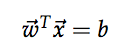 (14.3)

となる（(14.3)式）。超平面が法線ベクトルに垂直なので、超平面上の全ての点 _x_ は

    Tw x = -b

を満たす。（これは _b_ の符号を逆転させている?）

訓練点集合 __D__ ={( _x\_i_ , _y\_i_ )}

- _x\_i_ ...点
- _y\_i_ ...点 _x\_i_ に対応するラベル

線形分類器は次のようになる。

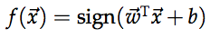 (15.1)

-1という値はあるクラスを示し、1という値は別のクラスを示す。

### マージンの定義

- __関数的マージン__
- __幾何学的マージン__

超平面 < _w_ , _b_ >に関する _i_ 番目の例 _x\_i_
の __関数的マージン__ を量

    y_i (Tw x + b)

と定義する。

決定面に関するデータ集合の関数的マージンを、
最小の関数的マージンをもつ任意のデータ点の関数的マージンの2倍とする。

この定義には問題があり、 _w_ と _b_ のスケールを変えるだけでいくらでも大きくできる。

=> _w_ のサイズに制約を課す必要がある。

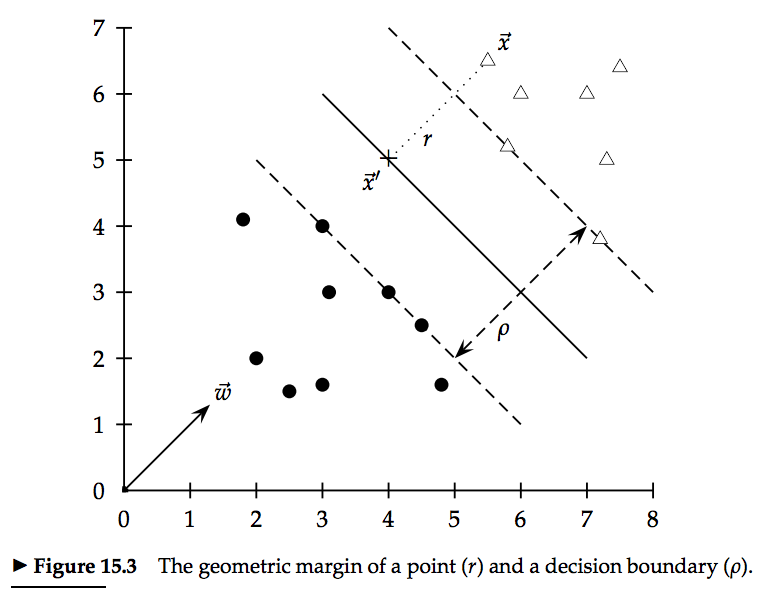

- _r_ ...点から決定境界へのユークリッド距離
- _x'_ ...超平面上で _x_ に最も近い点

点と超平面との最短距離は、平面への垂線であり _w_ と平行である。
この方向の単位ベクトルは _w / |w|_ である。
図15.3の点線は、ベクトル _rw / |w|_ を表す。
このとき

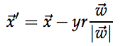 (15.2)

が成り立つ。
さらに、 _x'_ は決定境界にあり _wx'_ + _b_ = 0を満たす。
したがって

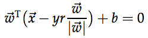 (15.3)

となる。これを _r_ について解くと

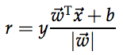 (15.4)

となる。

分類器の __幾何学的マージン__ _(geometric margin)_ は、
2つのクラスのサポートベクターを分離する幅の最大値である。
すなわち、 _r_ の最小値の2倍となる。

この定義によれば、 _w_ と _b_ のスケールを変えても、
_w_ の長さで正規化されているので、幾何学的マージンは変化しない。

    |w| = 1

と単位ベクトルを選べば、幾何学的マージンと関数的マージンを同じにする。

### SVMの標準形

（関数的マージンは好きなだけスケールできるため、巨大SVMを解くのに都合がいいように）
全てのデータ点の関数的マージンが1以上であり、
少なくとも1つのデータベクトルで1に等しいと仮定する。
すなわち、データの全項目について、

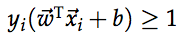 (15.5)

として、この不等式の等式が成り立つサポートベクターが存在すると仮定する。
超平面からの各データ点からの距離は(15.4)式で決まるので、
幾何学的マージンは ρ = 2 / _|w|_
となる(?)。この幾何学的マージンを最大化することが目的となる。

    |w| = Tw w

であり、2 / _|w|_ の最大化を _|w|_ / 2の最小化に置き換えると、
最小化問題としてのSVMの標準形が次のようになる。

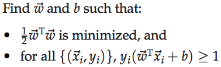 (15.6)

線形制約のもとで二次関数を最適化する。
__二次最適化問題__ は標準的な二次計画法 (QP) ライブラリを用いてSVMを作ることができる。

### SVMまとめ

- 訓練データ集合は、最良の分離超平面を一意に定める
- この平面を見つけるために、二次最適化問題を用いる
- 新しい点を分類するために、(15.1)式の分類関数が用いられる
 - 符号によって分類されるクラスが決定する
- 点がマージンの範囲内ならば、どちらかのクラスを返すのではなく、「わからない」と答えることもできる
- 分類関数の値は、ジグモイド関数を用いて分類確率に変換することができる

15.2 サポートベクターモデルへの拡張
------------------------------------

### 15.2.1 ソフトマージン分類

- 超高次元問題（テキスト分類など）...一般的に線形分離できない
 - 分離可能でも、ノイズ的な文書を無視して、大量のデータをよりよく分離できる解が望ましい

=> 小数の誤りを許容する幅のある決定マージンを許す

外れ値またはノイズ要素のいくつかの点は、マージンの内部または間違った側にある。
間違って分類された例に対してコストを支払わなければならない。

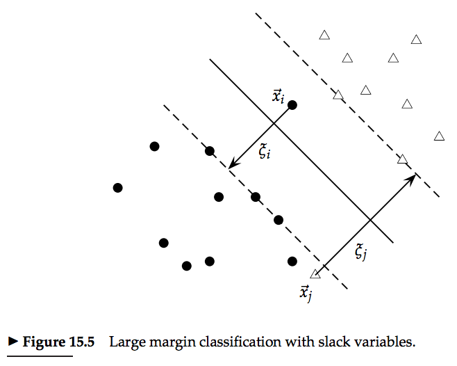

- ξ\_i...スラック変数 (ξ\_i ≧ 0)

ξ\_iが非ゼロ値なら _x\_i_ は、
マージンの要件に合致しなくてもξ\_iの値に比例するコストを払えばよい。

スラック変数のあるSVM最適化問題はつぎのようになる。

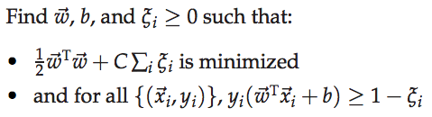 (15.10)

ソフトマージンSVMは、マージンとのトレードオフで、訓練誤差を最小化できる。
パラメータ _C_ は __正規化項__ で、オーバーフィットを制御する手段を与える。
_C_ が大きいときは幾何学的マージンが減り、データを尊重しなければ目的関数が大きくなってしまう。
_C_ が小さければ、データの塊をモデル化するように大きなマージンを取りやすくなる。

- 通常、サポートベクターは訓練データのごく一部
- 問題が分離不能またはマージンが小さい場合
 - 間違って分類されたデータ点またはマージン内のデータ点が増えると、非線形の場合に主な速度低下の原因となる

線形SVMの訓練及びテスト計算量

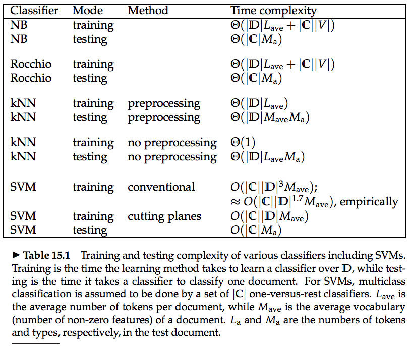

SVMの訓練時間は、QP（二次計画法）を解く時間で占められる。
QPを解く標準的な時間は、データ集合のサイズの3乗である (Kozlov et al. 1979) 。
最近の研究ではSVMの訓練に関する計算量が削減されており、その多くでは近似解を用いている。

### 15.2.2 複数クラスサポートベクターマシン

SVMは本質的に2クラス分類器である。SVMで複数クラスを扱う方法は以下のようなものがある。

- __|C|__ 個の1対他分類器を構築、テストデータを最大マージンで構築するクラスを選ぶ
- 一連の1対1分類器を組み立て、ほとんどの分類器が選ぶクラスにする
 - __|C|__ ( __|C|__ - 1 ) / 2 個の分類器の構築を含む
 - 各分類器の訓練データ集合は小さいので、分類器の訓練時間は減少する
- 多クラスSVMの構築
- 構造化SVM

### 15.2.3 非線形サポートベクターマシン

線形分類器による分類ができないデータ集合の場合はどうすればいいのか。

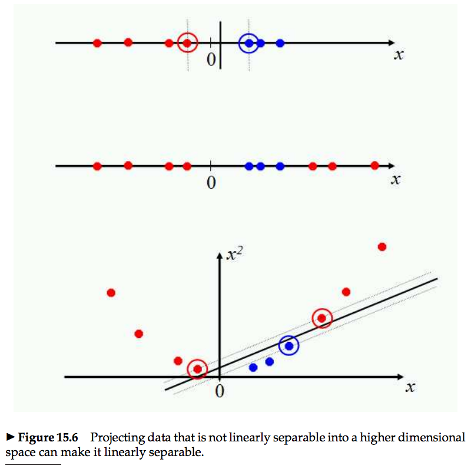

1次元の場合、図15.6で考える。
上段のデータ集合は線形分類器で分離可能。
中段のデータは線形分離できない。
下段のように、2次関数を用いてデータを2次元空間に写像すれば、
線形分類器で分離することができる。

SVM及び他の線形分類器は、 __カーネルトリック__
と呼ばれる高次元空間への写像を容易かつ効率的に行う方法を提供している。

### 15.2.4 実験結果

表13.9 テキスト分類の効果指標 Dumais et al. (1998)

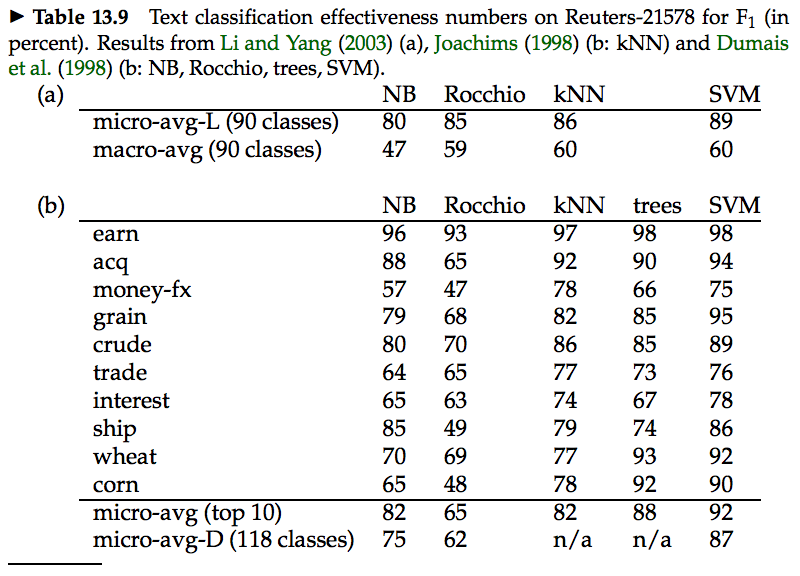

Dumais氏は、SVMが最良のテキスト分類器であることを示した。

表15.2 SVM分類器の損益分岐点F_1 Joachims (2002a)

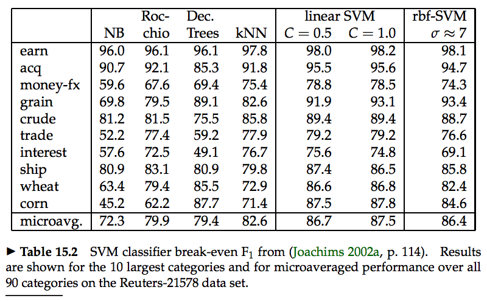

Joachims氏は、Reuters-21578データの全90カテゴリーについて、
大きい順に10個のカテゴリーとマイクロ平均した性能を示した。
